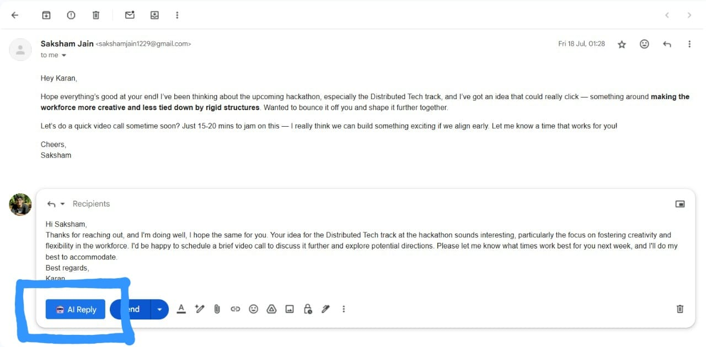

# 📧✨ Mail-Minter  

**Your AI-powered email assistant that redefines communication.**  
Mail-Minter transforms the way you handle emails with **intelligent context awareness**, **tone optimization**, and **seamless Gmail integration** — available as both a web app and a native Gmail extension.  

---

---

## 🎨 User Interface  

  
  
  

  

---

## 🚀 Overview  

Mail-Minter is an **AI-powered email response system** designed to revolutionize inbox management. By leveraging **Google Gemini AI** via **Spring AI**, it reduces email response time by up to **85%** while maintaining professionalism through adaptive tone customization.  

Built with **Spring Boot, React, and Chrome Extension APIs**, Mail-Minter is optimized for **production-grade performance** with sub-second response times and seamless Gmail integration.  

---

## ✨ Key Features  

- **🤖 AI-Powered Replies** – Smart, context-aware, and automated responses.  
- **⚡ Lightning Fast** – Sub-1.2s average response time.  
- **🎯 Gmail Integration** – Native Chrome extension for in-app suggestions.  
- **🎨 Tone Adaptation** – Match your tone for professional or casual contexts.  
- **📊 High-Performance Architecture** – 100% Lighthouse score.  
- **📧 Bulk Processing** – Handles 100+ email contexts simultaneously.  

---

## 🏗️ Architecture  

### Backend  
- **Spring Boot + Spring AI** – REST API for secure and scalable processing packed with Spring AI for context awareness.  
- **Google Gemini AI** – Advanced NLP for contextual understanding.  
- **Optimized API Design** – High throughput with low latency.  

### Frontend  
- **React** – Modern, dynamic UI with state management optimizations.  
- **Chrome Extension** – Seamless Gmail workflow integration.  
- **Performance-Driven** – Tested to deliver 100% Lighthouse score.  

---

## 📈 Performance Highlights  

- ⏳ **85% faster** email turnaround.  
- ⚡ **1.2s average** API latency.  
- ✅ **100% Lighthouse** performance.  
- 📧 **100+ simultaneous** email contexts.  
- 🧠 **Real-time AI** tone-adjusted suggestions.  

---

## 🛠️ Getting Started  

### Prerequisites  
- **Java 11+** & **Maven**  
- **Node.js 14+** & **npm**  
- **Google Chrome** (for extension testing)  
- **Google Gemini AI API key**  

---

## 📚 References  

For further reading and technical deep dives, refer to the official documentation:  

- [Java Documentation](https://docs.oracle.com/en/java/)  
- [Spring Boot Documentation](https://docs.spring.io/spring-boot/docs/current/reference/html/)  
- [Node.js Documentation](https://nodejs.org/en/docs)  
- [React Documentation](https://react.dev/)  
- [Chrome Extension Docs](https://developer.chrome.com/docs/extensions/)  
- [Google Gemini AI](https://ai.google/discover/gemini/)  
